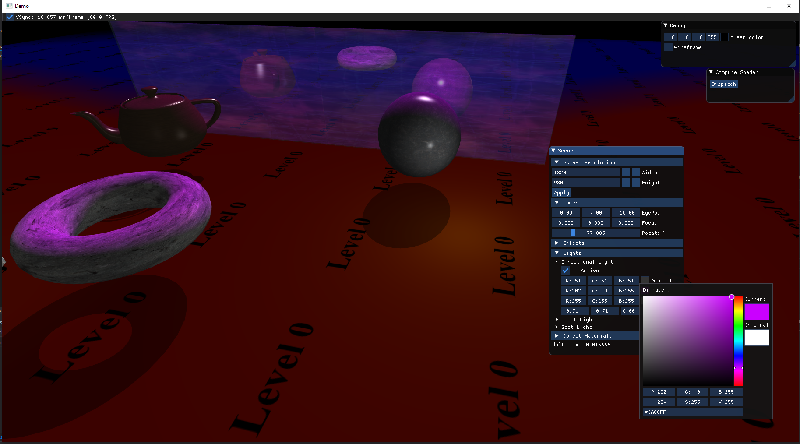
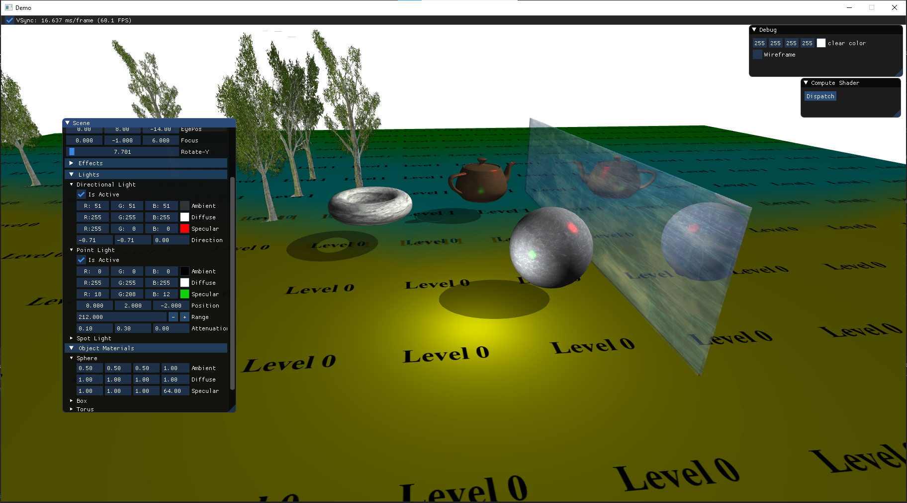
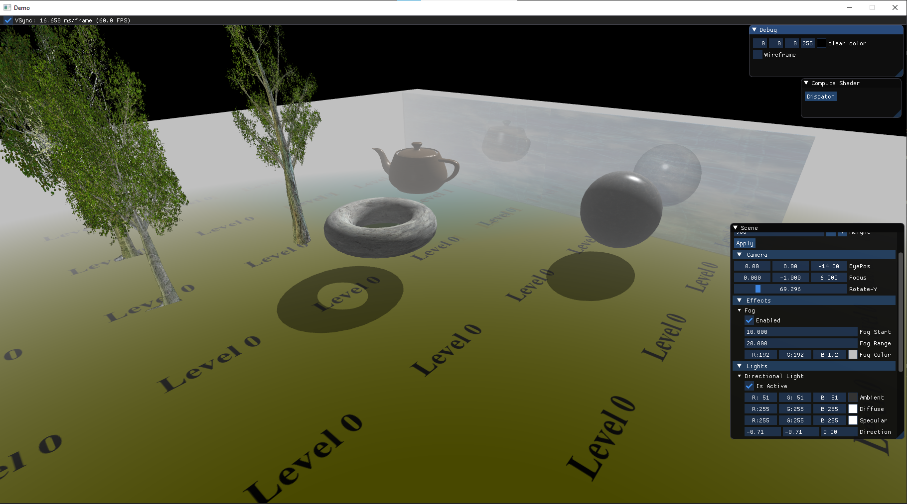
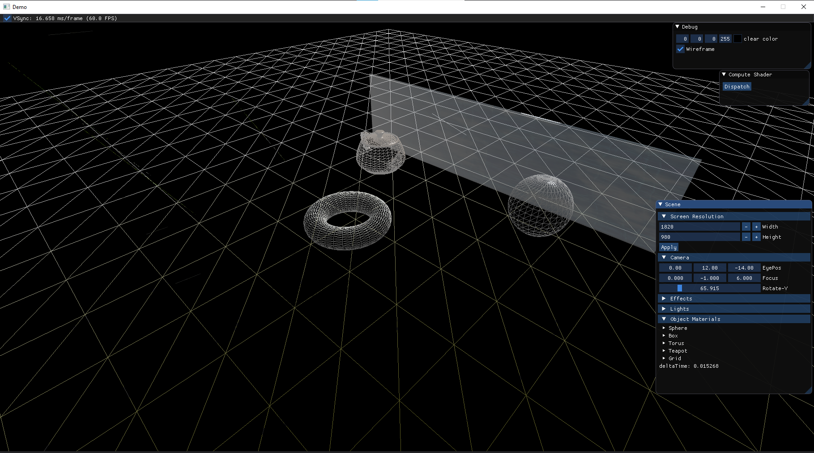

# Direct3D11 Graphics Demo

**Repository**:  
<a href="https://github.com/tiredbunny/Demo"><i class="fa fa-github" style="font-size:24px"></i></a>

**Description**:

I did this project to learn D3D11 more in-depth and implement various graphic techniques, using learning resources such as Frank Luna's [Introduction to 3D Game Programming With DirectX 11](https://www.amazon.com/Introduction-3D-Game-Programming-DirectX11/dp/1936420228), [Microsoft Docs](https://docs.microsoft.com/en-us/windows/win32/directx), [3DGep](https://www.3dgep.com/), etc. No deprecated/legacy frameworks like Effects11 are used.

**Main Features**:
* Flexible camera
* Effects:
    * Fog
* Phong lighting model:
  * Directional light
  * Point light
  * Spot light
* Billboard trees using geometry shader
* Simple compute shader
* Stencil reflection
* Planar shadows
* ImGui integration for adjusting most of the values (light color, screen size, etc.)

---
**Screenshots**:

