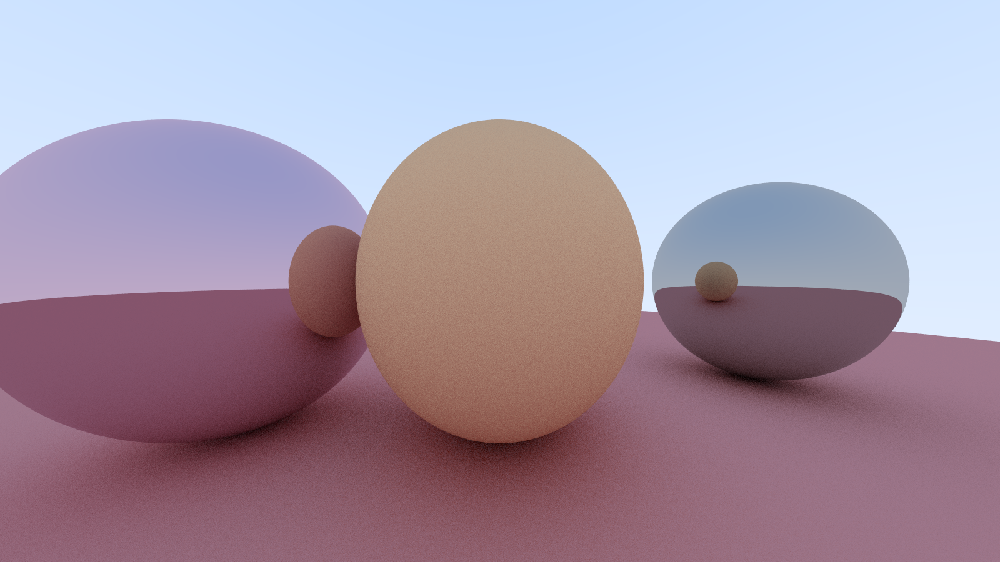
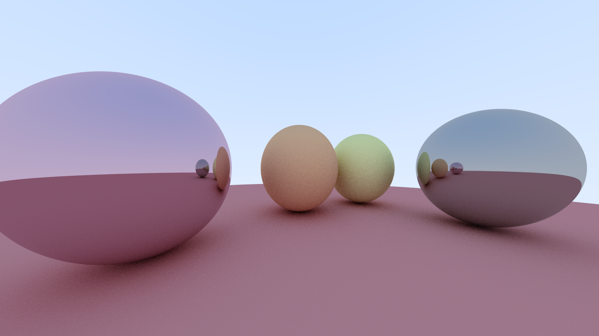
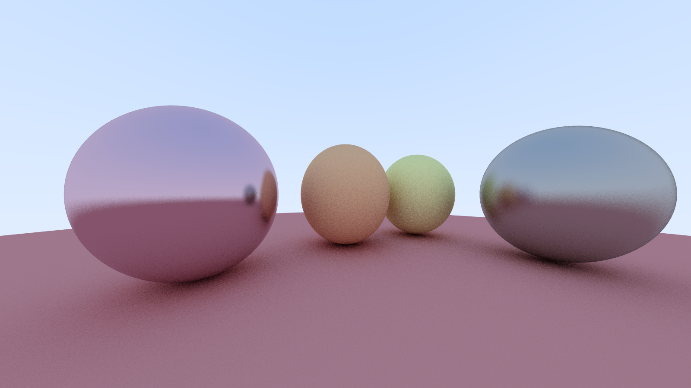

# Ray tracer

**Repository**:  
<a href="https://github.com/tiredbunny/RayTracing"><i class="fa fa-github" style="font-size:24px"></i></a>

**Description**:
This project is my implementation of the “Ray Tracing in One Weekend” book. Currently supports simple diffuse material, metal reflection material with fuzziness variable, and anti-aliasing by averaging many samples inside each pixel.

---
**Screenshots**:

